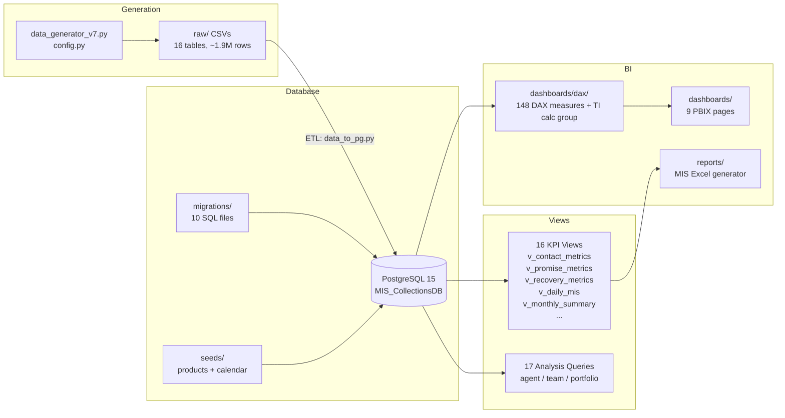

# MIS Collections — Local Analytics Environment


End-to-end collections analytics platform simulating a bank's full data infrastructure — from synthetic raw data generation, through a production-grade dimensional model in PostgreSQL, to KPI views, Power BI dashboards, and Excel MIS reporting.

---

## Overview

Simulated collections operations for a financial institution across **88 employees (8 supervisors + 80 agents)**, **~10,000 clients**, and **~15,480 accounts** spanning three product lines — Credit Cards, Personal Loans, and Mortgages.

The dataset covers the complete collections lifecycle over **12 months (Jan–Dec 2025, ~1.8M rows)**:

- Dialer operations & Right Party Contact (RPC) rates
- Promise-to-Pay (PTP) tracking & fulfillment (including multi-installment plans)
- Payment posting, agent-assisted vs. self-cures, and cure tracking
- Agent time tracking & utilization
- Post-charge-off recoveries
- Expected vs. actual payment reconciliation

---

## Business Use Case

Designed to answer real operational questions collections teams face daily:

| Question | Impact |
|---|---|
| Which agents are underperforming and need coaching? | Workforce optimization |
| Which portfolio segments show low RPC or conversion rates? | Targeted strategy adjustment |
| Are outbound strategies effective for high-risk accounts? | Dialer campaign ROI |
| How efficiently does agent time convert into recoveries? | Operational efficiency |

---

## Key Findings

The synthetic portfolio reproduces realistic, data-driven collections dynamics:

### High Arrears ≠ High Recovery
Accounts >90 days past due show **higher RPC rates but lower Kept Promise (KP%)**. As delinquency ages, converting conversations into payments becomes significantly harder — signaling a need for specialized recovery or settlement tactics.

### Outbound Drives Volume, Not Efficiency
Outbound calls generate the majority of PTPs but yield **lower KP% vs. inbound interactions**. Inbound callers demonstrate higher intent to pay; routing top agents to handle inbound flow maximizes recovery.

### The Utilization Trade-off
Agents pushed past **~85% utilization** experience a measurable drop in KP%. Overloading leads to rushed calls and reduced effectiveness in negotiating closed payments.

---

## What Makes This Stand Out

Beyond a simple ETL + BI pipeline, this project demonstrates:

- **A realistic dimensional model** — star schema with **8 dimension + 7 fact tables**, `SCD Type 2` employee history (6 mid-year org transfers), an ordered delinquency-bucket dimension, denormalized `product_type` on accounts, and no fact-to-fact FK chains.
- **Champion–challenger strategy arms** — every account is assigned one stable strategy arm (60/25/15 split) that drives channel mix *and* efficacy multipliers, enabling strategy→outcome attribution with real lift.
- **Collections-domain realism** — payday-seasonality payment spikes, weekday-only dialer (with payments allowed on weekends), per-agent monthly performance drift (±8%), progressive severity for repeat offenders, and delayed-cure decay.
- **Data-quality rigor** — **84 test cases passing** (81 fast + 3 slow) via a Hybrid-C suite: one shared fast-generation session for fast tests, plus slow gates for canonical 12-month row-count baselines, seed reproducibility, and ETL idempotency. Migration runner asserts the KPI-view count post-run to prevent silent drift.
- **Enterprise-scale BI layer** — **148 DAX measures** across 5 measure tables + an 18-item **`_Time Intelligence` Calculation Group**, plus a 9-dashboard blueprint with RLS-by-supervisor design.
- **Governance as a first-class citizen** — versioned migrations (001–010), seeds, column comments, a full data dictionary, and KPI definitions.
- **A three-tier SQL analysis layer** — 17 queries across supervisor / manager / director viewpoints, and a `learning/` practice lab that re-derives the KPI views from scratch.

---

## Tech Stack

| Layer | Technology |
|---|---|
| Data Generation | Python (pandas, Faker, psycopg2) |
| Database | PostgreSQL 15 (Docker + pgAdmin) |
| ETL | Python pipeline (idempotent, incremental, transactional) |
| Analytics | SQL (star schema, 16 KPI views) |
| Visualization | Power BI (148 measures + TI Calc Group), Excel (openpyxl) |
| Testing | pytest (84 tests, Hybrid-C fast/slow gates) |

---

## Architecture

```
Data Generation (Python)  →  Database Layer (PostgreSQL)
                                    ↓
                            Semantic Layer (SQL Views)
                                    ↓
                     Visualization (Power BI / Excel)
```

A standard 4-tier data architecture: synthetic data with real-world friction → structured star schema → centralized KPI calculations → automated reporting. The project ships as a **single cross-platform branch** on `main` — `./run_pipeline.sh` (Linux/macOS) or `./run_pipeline.bat` (Windows).

## Data Lineage



**Upstream → Downstream:** Generator → CSVs → PostgreSQL (star schema) → SQL Views → DAX measures → Power BI dashboards + Excel reports.

---

## KPI Framework

| Category | Metrics |
|---|---|
| **Contact** | RPC% (RPCs / Total Connections), Total Handle Time (THT), Utilization% |
| **Conversion** | PTP% (PTP / RPC), KP% (Kept Promises / Promises), BB Conversion (PTP% × KP%) |
| **Financial** | Cures (accounts recovered to $0 past due), Cured Amounts ($ recovered), Portfolio Cure Rate, Cures / THT, Recoveries |
| **Productivity** | Utilization%, Contacts per Agent Hour, Handle-time benchmarks (AHT/ACW) |

---

## Project Structure

```
mis-collections/
├── data_sources/          # Python data generators (P3/P4 engine, ~1.9M rows)
├── database/              # Docker config, migrations (001–010), seeds
├── etl/                   # Idempotent CSV → PostgreSQL pipeline
├── analysis/              # 17 SQL queries across agent/team/portfolio tiers
├── dashboards/            # DAX source of truth, theme, scripts, PBIX
├── reports/               # MIS reporting (Phase 10)
├── learning/              # JD-aligned practice lab (SQL/Python/Power BI/Excel)
├── docs/                  # Dictionaries, KPI definitions, blueprint, guides
├── test/                  # pytest suite (84 tests, Hybrid-C)
```

---

## Quick Start

```bash
# 1. Start the database
docker compose --env-file .env -f database/docker-compose.yml up -d

# 2. Generate synthetic data
python data_sources/data_generator_v7.py

# 3. Run the full pipeline (use the script for your OS)
./run_pipeline.sh      # Linux / macOS
./run_pipeline.bat     # Windows CMD
```

Detailed setup: [`docs/QUICKSTART.md`](docs/QUICKSTART.md)

---

## Documentation

| Doc | Description |
|-----|-------------|
| [`docs/QUICKSTART.md`](docs/QUICKSTART.md) | 5-minute setup guide |
| [`docs/TROUBLESHOOTING.md`](docs/TROUBLESHOOTING.md) | Error resolution reference |
| [`docs/KPI_VIEWS.md`](docs/KPI_VIEWS.md) | View documentation (13 of 16 views; rest documented inline in SQL) |
| [`docs/kpi_definitions.md`](docs/kpi_definitions.md) | KPI formulas and definitions |
| [`docs/data_dictionary.md`](docs/data_dictionary.md) | Column-level dictionary (16 tables) |
| [`docs/powerbi/dashboard_blueprint.md`](docs/powerbi/dashboard_blueprint.md) | 9-dashboard page-by-page wireframes |
| [`docs/powerbi/PHASE9_EXECUTION_PLAN.md`](docs/powerbi/PHASE9_EXECUTION_PLAN.md) | Actionable Phase 9 Power BI build plan |
| [`docs/CONTEXT.md`](docs/CONTEXT.md) | Full project context |
| [`docs/README.md`](docs/README.md) | Documentation index |
| [`docs/CHANGELOG.md`](docs/CHANGELOG.md) | Version history |
| [`docs/ROADMAP.md`](docs/ROADMAP.md) | Phase completion tracking |

---

## Status & Roadmap

**Current version:** 1.6.x — see [`docs/CHANGELOG.md`](docs/CHANGELOG.md).

- **Phase 9 (in progress):** Power BI dashboard build — 9 pages, import mode, star schema, 148 DAX measures + TI calculation group, RLS by supervisor.
- **Phase 10:** Excel daily MIS report generator (openpyxl).
- **Phase 11:** Publishing, user guide, and handoff.

**Future work:** predictive model for PTP keep probability, behavioral clustering for customer segmentation, and cohort analysis by delinquency stage.

---

> A complete simulation of a banking collections ecosystem — owning the entire data lifecycle, from business process modeling to relational design to strategic reporting.
